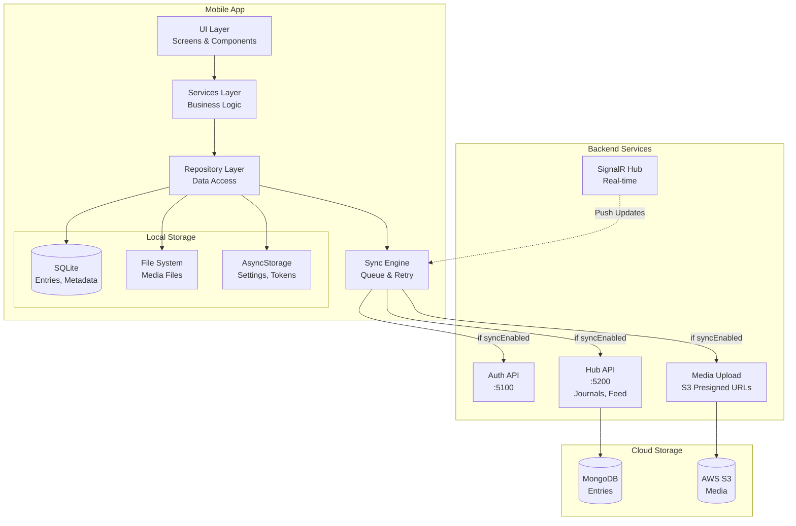
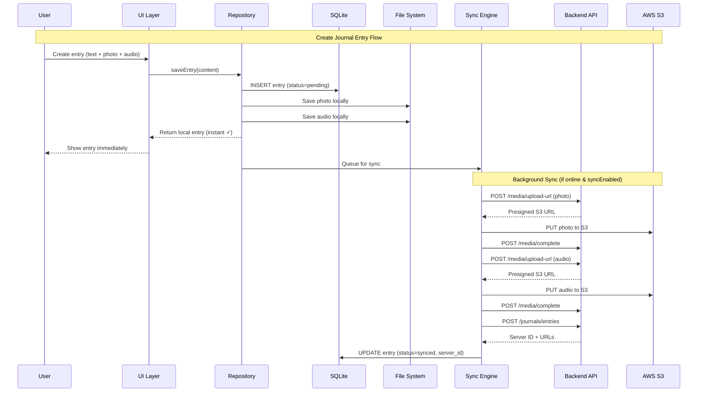
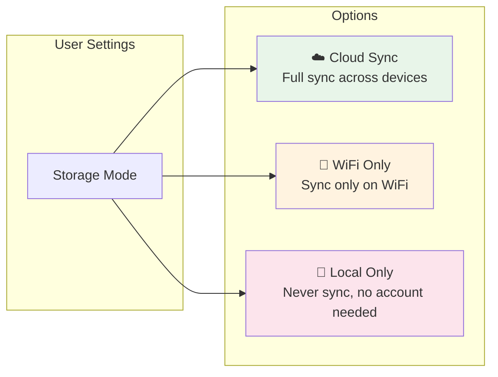
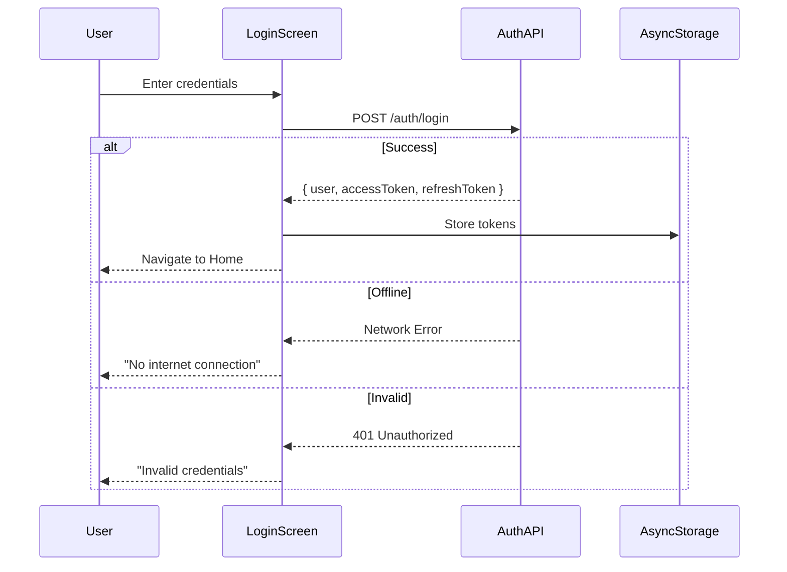
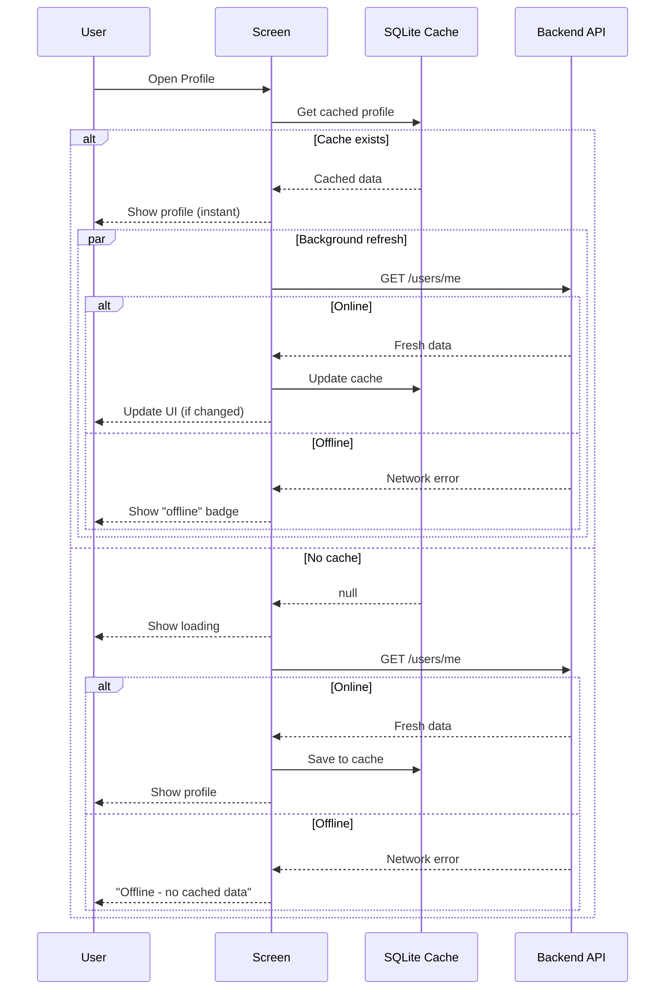
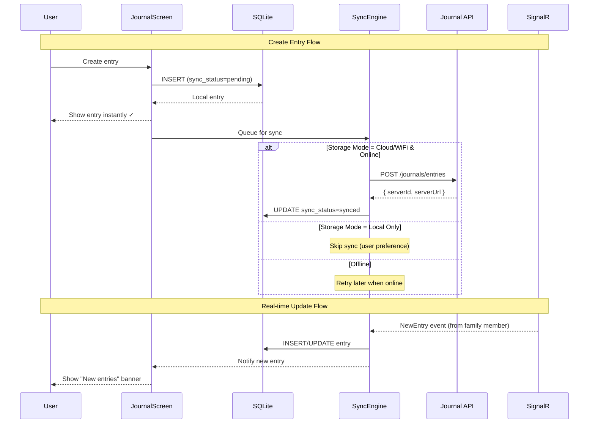
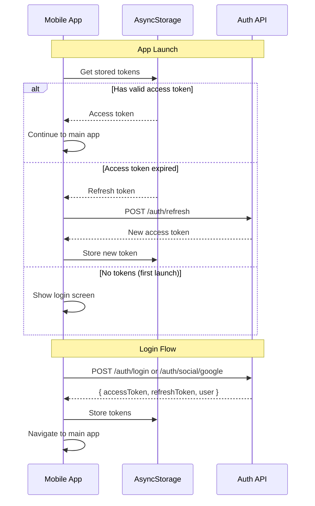

# FootPrint Mobile App - Architecture

> **Last Updated:** June 4, 2026

This document covers the **technical architecture** of the FootPrint React Native (Expo) mobile application, including data patterns, schemas, and folder structure.

---

## Table of Contents

1. [High-Level Architecture](#high-level-architecture)
2. [Data Flow Architecture](#data-flow-architecture)
3. [Data Storage Strategy](#data-storage-strategy-offline-first-with-hybrid-sync)
4. [Screen-Level Architecture Patterns](#screen-level-architecture-patterns)
5. [Local Database Schema](#local-database-schema-sqlite)
6. [Content Block Schema](#content-block-schema)
7. [API Integration](#api-integration)
8. [Folder Structure](#folder-structure)

---

## High-Level Architecture



---

## Data Flow Architecture



---

## Data Storage Strategy: Offline-First with Hybrid Sync

### Why Offline-First?

| Benefit | Description |
|---------|-------------|
| **Instant UI** | No loading spinners for local operations |
| **Works Offline** | Users can journal anywhere (airplane, rural, subway) |
| **Battery Efficient** | Batched network calls instead of constant requests |
| **Resilient** | No data loss on network failures |
| **User Control** | Option to keep data local-only for privacy |

### Storage Mode Toggle

Users can choose how their data is stored and synced:



| Mode | Account Required | Sync Behavior | Use Case |
|------|-----------------|---------------|----------|
| **Cloud Sync** | ✅ Yes | Always sync when online | Families sharing, multi-device |
| **WiFi Only** | ✅ Yes | Sync only on WiFi | Data-conscious users |
| **Local Only** | ❌ No | Never sync | Privacy-focused, testing, kids |

---

## Screen-Level Architecture Patterns

Different screens require different data handling strategies based on their specific requirements.

```mermaid
graph TB
    subgraph "Pattern 1: Auth-Required, Online-Only"
        L1[Login Screen] --> API1[Auth API]
        L2[OAuth Callbacks] --> API1
        API1 --> T1[Tokens to<br/>AsyncStorage]
    end
    
    subgraph "Pattern 2: Cached with Background Refresh"
        P1[Profile Screen] --> C1{Cache<br/>exists?}
        C1 -->|Yes| UI1[Show cached data]
        C1 -->|No| LOAD1[Show loading]
        UI1 --> BG1[Background API fetch]
        LOAD1 --> BG1
        BG1 --> UPD1[Update cache & UI]
        
        F1[Family/Friends] --> C1
    end
    
    subgraph "Pattern 3: Offline-First with Sync"
        J1[Journal Screen] --> DB1[(SQLite)]
        DB1 --> UI2[Instant UI]
        UI2 --> Q1[Queue for sync]
        Q1 -->|if online & enabled| SYNC1[Sync Engine]
        SYNC1 --> API3[Journal API]
        API3 -.->|SignalR| RT1[Real-time updates]
        RT1 -.-> DB1
    end
    
    style L1 fill:#ffcdd2
    style L2 fill:#ffcdd2
    style P1 fill:#fff9c4
    style F1 fill:#fff9c4
    style J1 fill:#c8e6c9
```



### Pattern 1: Auth-Required, Online-Only

**Used By:** Login Screen, OAuth callbacks

**Behavior:**
- Direct API calls with no local caching
- Requires internet connection to function
- Stores tokens in AsyncStorage after successful auth
- Redirects to login if tokens expired and refresh fails

**Rationale:** Authentication tokens must come from the server. There's no way to authenticate offline.



---

### Pattern 2: Cached with Background Refresh

**Used By:** Profile Screen, Family Screen, Friends Screen, Settings

**Behavior:**
1. On mount: Load cached data from SQLite immediately
2. Show cached data to user (no loading spinner if cache exists)
3. Fetch fresh data from API in background
4. Update cache and UI when fresh data arrives
5. If offline: Show cached data + "offline" indicator
6. If no cache and offline: Show "offline" message

**Rationale:** User expects to see their profile instantly. Read-heavy screens benefit from caching.



---

### Pattern 3: Offline-First with Sync

**Used By:** Journal Screen, Media Gallery

**Behavior:**
1. ALL writes go to local SQLite first (never wait for network)
2. Show optimistic UI immediately (entry appears instantly)
3. Queue changes for sync (respects storage mode setting)
4. Background sync when online (if sync enabled)
5. Receive real-time updates via SignalR (if connected)
6. Conflict resolution on merge (last-write-wins by default)

**User Settings Toggle:**
| Mode | Sync Behavior | Account Required |
|------|---------------|------------------|
| ☁️ Cloud Sync | Always sync when online | Yes |
| 📶 WiFi Only | Sync only on WiFi | Yes |
| 📱 Local Only | Never sync | No |

**Rationale:** Users journal in airplanes, rural areas, subways. The core experience must never depend on network.



---

## Local Database Schema (SQLite)

```sql
-- Journal entries stored locally
CREATE TABLE journal_entries (
    local_id TEXT PRIMARY KEY,           -- UUID generated locally
    server_id TEXT,                       -- NULL until synced
    journal_id TEXT NOT NULL,
    user_id TEXT NOT NULL,
    date TEXT NOT NULL,                   -- ISO date string
    content_blocks TEXT NOT NULL,         -- JSON array
    location_lat REAL,
    location_lng REAL,
    location_name TEXT,
    visibility TEXT DEFAULT 'private',    -- private|friends|family|public
    sync_status TEXT DEFAULT 'pending',   -- pending|syncing|synced|conflict|local_only
    created_at INTEGER NOT NULL,          -- Unix timestamp
    updated_at INTEGER NOT NULL,
    synced_at INTEGER                     -- NULL if never synced
);

-- Media files pending upload
CREATE TABLE media_queue (
    local_id TEXT PRIMARY KEY,
    entry_local_id TEXT NOT NULL,         -- FK to journal_entries
    file_path TEXT NOT NULL,              -- Local file path
    media_type TEXT NOT NULL,             -- image|video|audio
    file_size INTEGER NOT NULL,
    server_url TEXT,                      -- NULL until uploaded
    thumbnail_path TEXT,                  -- Local thumbnail for videos
    upload_status TEXT DEFAULT 'pending', -- pending|uploading|uploaded|failed
    retry_count INTEGER DEFAULT 0,
    error_message TEXT,
    created_at INTEGER NOT NULL,
    FOREIGN KEY (entry_local_id) REFERENCES journal_entries(local_id)
);

-- Sync metadata for incremental sync
CREATE TABLE sync_metadata (
    key TEXT PRIMARY KEY,
    value TEXT NOT NULL
);
-- Keys: 'last_sync_timestamp', 'last_entries_cursor', 'storage_mode'

-- Cached user data for offline access
CREATE TABLE cached_users (
    user_id TEXT PRIMARY KEY,
    name TEXT,
    avatar_url TEXT,
    avatar_local_path TEXT,               -- Cached avatar image
    updated_at INTEGER
);
```

---

## Content Block Schema

```typescript
// Each journal entry contains an array of content blocks
type ContentBlock = 
  | { type: 'text'; content: string }
  | { type: 'photos'; media: MediaInfo[] }
  | { type: 'audio'; media: MediaInfo[]; duration: number; waveform?: number[] }
  | { type: 'video'; media: MediaInfo[]; duration: number; thumbnail?: string };

type MediaInfo = {
  localId: string;        // Always present (UUID)
  localPath: string;      // Local file path
  serverId?: string;      // Present after upload
  serverUrl?: string;     // Present after upload
  thumbnailUrl?: string;
  width?: number;
  height?: number;
  location?: {
    lat: number;
    lng: number;
    name?: string;
  };
};
```

---

## API Integration

The mobile app integrates with the existing FootPrint backend:

### Endpoints Used

| Service | Endpoint | Purpose |
|---------|----------|---------|
| **Auth** | `POST /api/v1/auth/login` | Email/password login |
| **Auth** | `POST /api/v1/auth/social/google` | Google OAuth |
| **Auth** | `POST /api/v1/auth/refresh` | Refresh access token |
| **Journal** | `GET /api/v1/journals` | List user's journals |
| **Journal** | `GET /api/v1/journals/{id}/entries` | Get entries (paginated) |
| **Journal** | `POST /api/v1/journals/entries` | Create entry |
| **Journal** | `PATCH /api/v1/journals/entries/{id}` | Update entry |
| **Journal** | `DELETE /api/v1/journals/entries/{id}` | Delete entry |
| **Media** | `POST /api/v1/media/upload-url` | Get S3 presigned URL |
| **Media** | `POST /api/v1/media/complete` | Confirm upload complete |
| **Feed** | `GET /api/v1/feed` | Get personalized feed |
| **Users** | `GET /api/v1/users/me` | Get current user |
| **Users** | `PUT /api/v1/users/me/location` | Update user location |

### Authentication Flow



### SignalR Real-time Events

| Event | Description |
|-------|-------------|
| `ReceiveMessage` | New chat message |
| `ReceiveTyping` | Typing indicator |
| `ReceivePresence` | User online/offline |
| `ReceiveNotification` | New notification |
| `ConversationUpdated` | Conversation update |
| `ReceiveFriendRequest` | Friend request |
| `MessageRead` | Message read receipt |
| `ConversationRead` | Conversation read |

---

## Folder Structure

```
footprint-mobile-app/
├── App.js                        # Main entry point
├── app.json                      # Expo configuration
├── eas.json                      # EAS Build configuration
├── package.json                  # Dependencies
├── assets/
│   ├── icons/
│   └── images/
└── src/
    ├── api/                      # API client and endpoints
    │   ├── index.js
    │   ├── ApiClient.js          # HTTP client with auth & retry
    │   ├── JournalApi.js         # Journal endpoints
    │   ├── MediaApi.js           # S3 presigned URL uploads
    │   └── PlacesApi.js          # Places endpoints
    │
    ├── components/               # Reusable UI components
    │   ├── common/
    │   │   ├── index.js
    │   │   ├── ConnectionStatusIndicator.js
    │   │   └── NotificationBadge.js
    │   ├── journal/
    │   │   ├── index.js
    │   │   ├── JournalEntryCard.js
    │   │   ├── MediaGalleryTab.js
    │   │   ├── FloatingActionButton.js
    │   │   ├── JournalComposeModal.js
    │   │   ├── CalendarCoils.js
    │   │   ├── DateSwipeContainer.js
    │   │   ├── EngagementSection.js
    │   │   └── ReactionPicker.js
    │   ├── media/
    │   │   ├── index.js
    │   │   ├── AudioRecorder.js
    │   │   ├── AudioPlayer.js
    │   │   ├── CameraCapture.js
    │   │   ├── MediaPicker.js
    │   │   ├── VideoThumbnail.js
    │   │   └── MediaPreview.js
    │   ├── map/
    │   │   ├── index.js
    │   │   ├── EntryMarker.js
    │   │   ├── JournalMapView.js
    │   │   └── LocationPicker.js
    │   └── places/
    │       ├── index.js
    │       ├── MemoryCard.js
    │       ├── YearMemoriesModal.js
    │       ├── ThenNowComparison.js
    │       ├── IWasHereIndicator.js
    │       ├── MemoryRequestCard.js
    │       └── ShareMemorySheet.js
    │
    ├── config/
    │   ├── api.config.js         # API URLs per environment
    │   └── oauth.config.js       # Google OAuth client IDs
    │
    ├── context/
    │   ├── index.js
    │   ├── AuthContext.js        # Authentication state
    │   └── RealtimeContext.js    # SignalR real-time state
    │
    ├── data/                     # Mock data for prototyping
    │   ├── familyData.js
    │   ├── familyJournalData.js
    │   ├── friendsData.js
    │   ├── mockData.js
    │   └── placesData.js
    │
    ├── database/                 # SQLite local storage
    │   ├── index.js              # Database init & management
    │   ├── schema.js             # Table definitions
    │   └── migrations.js         # Schema versioning
    │
    ├── hooks/                    # Custom React hooks
    │   ├── index.js
    │   ├── useJournal.js         # Journal CRUD hook
    │   └── useJournalRealtime.js # Real-time updates hook
    │
    ├── navigation/
    │   └── AppNavigator.js       # Bottom tab + stack navigation
    │
    ├── repositories/             # Data access layer
    │   ├── index.js
    │   ├── BaseRepository.js     # Base class with patterns
    │   └── JournalRepository.js  # Journal data access
    │
    ├── screens/
    │   ├── index.js
    │   ├── HomeScreen.js
    │   ├── JournalScreen.js      # Two tabs: Feed + Gallery
    │   ├── JournalEntryDetail.js # Full entry view
    │   ├── FamilyScreen.js
    │   ├── FriendsScreen.js
    │   ├── PersonJournalScreen.js # View someone's journal
    │   ├── PlacesScreen.js
    │   ├── InterviewModeScreen.js # Elder interview recording
    │   ├── ProfileScreen.js
    │   ├── SettingsScreen.js
    │   └── LoginScreen.js
    │
    ├── services/                 # Business logic
    │   ├── index.js
    │   ├── DatabaseService.js    # SQLite operations
    │   ├── FileService.js        # Local file management
    │   ├── JournalService.js     # Journal business logic
    │   ├── LocationService.js    # GPS & geocoding
    │   ├── ProfileService.js     # User profile API
    │   ├── SettingsService.js    # App settings
    │   └── SignalRService.js     # WebSocket connection
    │
    ├── sync/                     # Offline-first sync engine
    │   ├── index.js
    │   ├── SyncEngine.js         # Main sync orchestrator
    │   ├── SyncQueue.js          # Operation queue
    │   ├── ConflictResolver.js   # Conflict strategies
    │   └── NetworkMonitor.js     # Connectivity detection
    │
    └── utils/
        ├── dateUtils.js
        ├── fileUtils.js
        └── validators.js
```

---

## Dependencies

### Core
```json
{
  "expo": "~54.0.0",
  "react": "18.x",
  "react-native": "0.76.x",
  "@react-navigation/native": "^7.x",
  "@react-navigation/bottom-tabs": "^7.x"
}
```

### Local Storage & Sync
```json
{
  "expo-sqlite": "~15.0.0",
  "expo-file-system": "~18.0.0",
  "@react-native-community/netinfo": "^11.4.0",
  "uuid": "^10.0.0"
}
```

### Media
```json
{
  "expo-camera": "~16.0.0",
  "expo-av": "~15.0.0",
  "expo-image-picker": "~16.0.0",
  "expo-media-library": "~17.0.0",
  "expo-video-thumbnails": "~8.0.0"
}
```

### Maps & Location
```json
{
  "react-native-maps": "~1.20.1",
  "expo-location": "~18.1.5"
}
```

### Real-time
```json
{
  "@microsoft/signalr": "^9.x"
}
```
