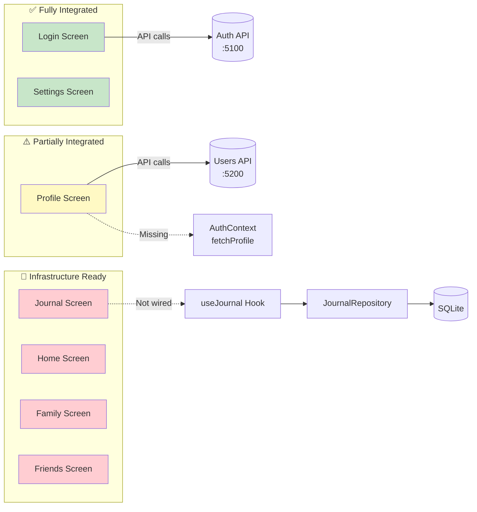
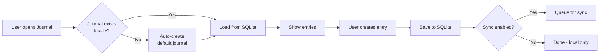

# FootPrint Mobile App - TODO & Backlog

> **Last Updated:** June 6, 2026

This document tracks **tasks, integration gaps, and the prioritized backlog** for the FootPrint mobile application.

---

## Table of Contents

1. [Current Status Overview](#current-status-overview)
2. [Integration Gaps](#integration-gaps)
3. [Prioritized TODO List](#prioritized-todo-list)
4. [Journal UI Enhancements](#journal-ui-enhancements)
5. [Before Testing Phase](#before-testing-phase)
6. [Before Store Submission](#before-store-submission)
7. [Implementation Phases Status](#implementation-phases-status)

---

## Current Status Overview

| Item | Status | Notes |
|------|--------|-------|
| **Project Setup** | ✅ Done | Expo SDK 54, React Navigation |
| **Navigation** | ✅ Done | Bottom tabs with 5 screens |
| **Screen Placeholders** | ✅ Done | Home, Journal, Family, Friends, Profile |
| **EAS Configuration** | ✅ Done | eas.json configured |
| **GitHub Actions** | ✅ Done | Workflow ready (needs secrets) |
| **Authentication** | | |
| Email/Password Login | ✅ Done | Registration and login working |
| Google Sign-In (Web) | ✅ Done | Working on localhost:8081 |
| Google Sign-In (iOS) | ✅ Done | Client ID configured |
| Google Sign-In (Android) | ⏳ Pending | Needs client ID and SHA-1 |
| Apple Sign-In | ⏳ Pending | Placeholder only |
| Facebook Sign-In | ⏳ Pending | Placeholder only |
| **Journal Feature** | | |
| Phase 1: Foundation & Local Storage | ✅ Done | SQLite, DatabaseService, SettingsService, FileService |
| Phase 2: Journal Repository & Service | ✅ Done | Local-first CRUD, hooks, optimistic UI |
| Phase 3: Sync Engine | ✅ Done | Queue, retry, conflict resolution |
| Phase 4: Media Capture | ✅ Done | Audio recorder, camera, gallery, preview |
| Phase 5: Enhanced Journal Screen | ✅ Done | Two tabs (Feed / Media Gallery), FAB |
| Phase 6: Map Integration | ✅ Done | LocationService, map view, location picker |
| Phase 7: Settings & Privacy | ✅ Done | Storage mode, export, delete cloud data |
| Phase 8: Real-time Updates | ✅ Done | SignalR integration |
| **Other** | | |
| App Icons/Splash | ⏳ Pending | Using default Expo assets |
| Developer Accounts | ⏳ Pending | Need Apple & Google accounts |
| Testing | ⏳ Pending | Ready when app is complete |
| Store Submission | ⏳ Pending | After testing phase |

---

## Integration Gaps

While all 8 phases have been built, some screens are not yet fully wired to the infrastructure.

### Screen Integration Status



---

### Login Screen ✅ Fully Integrated

| Component | Status | Details |
|-----------|--------|---------|
| Email/Password Auth | ✅ Working | Calls `localhost:5100/api/v1/auth/login` |
| Registration | ✅ Working | Calls `localhost:5100/api/v1/auth/register` |
| Google OAuth | ✅ Working | Web + iOS configured, Android pending |
| Token Storage | ✅ Working | AsyncStorage with auto-restore |
| Token Refresh | ✅ Working | Automatic refresh on 401 |
| Offline Handling | ✅ Correct | Shows "No internet" error (expected) |

**No action required.**

---

### Profile Screen ⚠️ Partially Integrated

| Component | Status | Details |
|-----------|--------|---------|
| Display User Data | ✅ Working | Shows user from AuthContext |
| Education CRUD | ✅ Working | ProfileService API calls |
| Employment CRUD | ✅ Working | ProfileService API calls |
| Addresses CRUD | ✅ Working | ProfileService API calls |
| `fetchProfile()` | ❌ **Missing** | Called but not defined in AuthContext |
| `updateProfile()` | ❌ **Missing** | Called but not defined in AuthContext |
| Offline Cache | ❌ Missing | No local caching of profile data |
| Offline Indicator | ❌ Missing | No "offline" badge when disconnected |

**Gaps Found:**

1. **`fetchProfile()` not in AuthContext** - ProfileScreen calls `fetchProfile()` on mount and refresh, but this function doesn't exist:
   ```javascript
   // ProfileScreen.js line 168
   const { user, logout, fetchProfile, updateProfile, accessToken } = useAuth();
   
   // AuthContext.js - these functions don't exist!
   ```

2. **No local caching** - Profile data should be cached in SQLite and shown immediately, with background refresh.

---

### Journal Screen 🔧 Infrastructure Ready, Not Wired

| Component | Status | Details |
|-----------|--------|---------|
| UI (Feed tab) | ✅ Done | Beautiful two-tab layout |
| UI (Gallery tab) | ✅ Done | Media grid with filters |
| Floating Action Button | ✅ Done | Expandable menu |
| Compose Modal | ✅ Done | Text, media, location |
| Entry Detail View | ✅ Done | Full-screen view |
| **Data Source** | ❌ **Hardcoded** | Uses `SAMPLE_ENTRIES` constant |
| useJournal Hook | ✅ Built | Not connected to screen |
| JournalService | ✅ Built | Not called by screen |
| JournalRepository | ✅ Built | Not used |
| SyncEngine | ✅ Built | Not initialized |
| SignalR Real-time | ✅ Built | Context connected, not using data |

**Gaps Found:**

1. **Hardcoded sample data** - JournalScreen uses fake data instead of the built infrastructure:
   ```javascript
   // JournalScreen.js line ~70
   const SAMPLE_ENTRIES = [
     { localId: '1', ... }, // Fake data!
   ];
   
   // Line ~281
   // TODO: Replace with real data from useJournal hook
   const entries = SAMPLE_ENTRIES;  // ← Should use useJournal
   ```

2. **useJournal hook commented out**:
   ```javascript
   // JournalScreen.js line 48
   // import { useJournal } from '../hooks/useJournal';  // Commented!
   ```

3. **No journalId available** - useJournal requires a `journalId`, but:
   - User object doesn't include a default journal ID
   - No auto-creation of journal on first use
   - Backend may need to auto-create journal on registration

4. **Compose modal doesn't save** - When user creates entry, it doesn't call JournalService.

---

### Home Screen 🔧 Placeholder Only

| Component | Status | Details |
|-----------|--------|---------|
| UI | ⚠️ Basic | Placeholder with welcome message |
| Feed Integration | ❌ Missing | Should show aggregated feed |
| Quick Actions | ❌ Missing | Quick journal entry button |

---

### Family Screen 🔧 Placeholder Only

| Component | Status | Details |
|-----------|--------|---------|
| UI | ⚠️ Basic | Placeholder only |
| Family List | ❌ Missing | No API integration |
| Family Entries | ❌ Missing | Should show family journal feed |

---

### Friends Screen 🔧 Placeholder Only

| Component | Status | Details |
|-----------|--------|---------|
| UI | ⚠️ Basic | Placeholder only |
| Friends List | ❌ Missing | No API integration |
| Friend Requests | ❌ Missing | No API integration |

---

### Settings Screen ✅ Fully Integrated

| Component | Status | Details |
|-----------|--------|---------|
| Storage Mode Toggle | ✅ Working | Cloud/WiFi/Local options |
| Theme Toggle | ✅ Working | Light/Dark/System |
| Export Data | ✅ Working | JSON export with Share |
| Delete Cloud Data | ✅ Working | Double confirmation |
| Sync Status | ✅ Working | Shows synced/pending/offline |
| Logout | ✅ Working | Clears tokens and navigates |

**No action required.**

---

## Prioritized TODO List

> **Priority Order:** Based on core feature importance and dependency chain.

### Task 1: Deploy Mobile App as a Web Build (Dev/Testing) 🚀

Host the Expo app as a static web build so collaborators can test in a browser
(e.g. designers uploading & testing journal images) without installing anything.

| Task | Description | Effort |
|------|-------------|--------|
| **1.a** | Create `src/api/MediaApi.web.js` — web image upload via `fetch` PUT + Blob (replaces Expo-only `FileSystem.createUploadTask`) | ~30 min |
| **1.b** | Build static site: `npx expo export --platform web` → `dist/` | Small |
| **1.c** | Host on S3 + CloudFront (HTTPS via default `*.cloudfront.net` domain) or Netlify/Vercel | Small |
| **1.d** | Add hosted origin to backend CORS (both `Program.cs`) + redeploy | Small |
| **1.e** | Add hosted origin to Google Cloud Console (JS origin + redirect URI) — **manual** | Small |

**Notes:** Metro isolates `.web.js` from native, so zero risk to the shipping app.
Web build uses the localStorage DB shim → UI/flow/upload testing only, NOT a real
offline-sync test. Requires `hub`/`auth`/`users` ECS services running (currently 0).
Cost: free (Netlify/Vercel) or ~$1–5/mo (S3+CloudFront).

---

### Priority 1: Wire Up Journal Screen (Core Feature) 🔴

The Journal is the core feature of the app. The infrastructure is 90% complete - we just need to connect it.

| Task | Description | Effort |
|------|-------------|--------|
| **1.1** | Remove `SAMPLE_ENTRIES` and wire `useJournal` hook | Small |
| **1.2** | Auto-create default journal on first use (local) | Small |
| **1.3** | Connect JournalComposeModal to JournalService | Medium |
| **1.4** | Initialize SyncEngine on app start (if sync enabled) | Small |
| **1.5** | Pass real `journalId` and `userId` to hooks | Small |

**Approach:** Local-first, no account required to start journaling. Users can enable sync later.



---

### Priority 2: Fix Profile Screen (AuthContext Gap) 🟡

ProfileScreen calls functions that don't exist in AuthContext.

| Task | Description | Effort |
|------|-------------|--------|
| **2.1** | Add `fetchProfile()` to AuthContext | Medium |
| **2.2** | Add `updateProfile()` to AuthContext | Medium |
| **2.3** | Add SQLite cache for profile data | Medium |
| **2.4** | Implement background refresh pattern | Small |
| **2.5** | Add offline indicator badge | Small |

**Approach:** Cache-first with background refresh (Pattern 2 from Architecture).

---

### Priority 3: Complete Sync Integration 🟢

Ensure sync toggle is respected throughout the app.

| Task | Description | Effort |
|------|-------------|--------|
| **3.1** | Check `storageMode` before queuing sync operations | Small |
| **3.2** | Show "Local Only" badge when sync disabled | Small |
| **3.3** | Add data loss warning for Local Only mode | Small |
| **3.4** | Test sync with real backend (when available) | Medium |

---

### Priority 4: Implement Remaining Screens 🔵

These can be done incrementally after core features work.

| Task | Description | Effort |
|------|-------------|--------|
| **4.1** | Home Screen - aggregated feed | Large |
| **4.2** | Family Screen - family list & entries | Large |
| **4.3** | Friends Screen - friend list & requests | Large |

---

## Journal UI Enhancements

> **Status:** Social features and navigation completed

| Priority | Component | Description | Status |
|----------|-----------|-------------|--------|
| 1 | Visibility System | Add visibility field to entries, create picker | ✅ Done |
| 2 | JournalScreen Update | Filter tabs, visibility icons, engagement display | ⏭️ Skipped |
| 3 | FamilyScreen Navigation | Tap head → family journal, tap member → individual | ✅ Done |
| 4 | PersonJournalScreen | View someone's shared entries (read-only) | ✅ Done |
| 5 | Reactions Component | Add meaningful reactions (❤️🙏😢😊🤗) | ✅ Done |
| 6 | Comments/Responses | Threaded conversations (EngagementSection) | ✅ Done |
| 7 | FriendsScreen Navigation | Tap org → group journal, tap friend → individual | ✅ Done |

**Notes:**
- Priority 2 skipped because filter tabs conflicted with calendar day-flipping UI concept
- Reactions & Comments combined into EngagementSection component

---

## Before Testing Phase

- [ ] **Create app icons**
  - Icon: 1024x1024 PNG (no transparency for iOS)
  - Adaptive icon: Foreground + background layers
  - Use tool: [Expo Icon Builder](https://buildicon.netlify.app/)

- [ ] **Create splash screen**
  - Image: 1284x2778 PNG (iPhone 14 Pro Max size)
  - Keep important content in center 640x1136 safe zone

- [ ] **Implement remaining screens**
  - Port web app features to mobile
  - Handle mobile-specific UX (gestures, etc.)

- [ ] **Add environment variables**
  - API endpoints for dev/staging/production
  - Create `.env` files

---

## Before Store Submission

- [ ] **Create Expo account** (`eas login`)
- [ ] **Link project to EAS** (`eas init`)
  - Generates project ID for `app.json`
- [ ] **Create Apple Developer Account** ($99/year)
- [ ] **Create Google Play Developer Account** ($25 one-time)
- [ ] **Configure app store credentials in `eas.json`**
- [ ] **Create Google Service Account** for automated Play Store uploads
- [ ] **Prepare store listings**
  - App name, description, keywords
  - Screenshots (6.5" iPhone, 5.5" iPhone, Android phone, tablet)
  - Privacy policy URL
  - Support URL

---

## Implementation Phases Status

All 8 phases of the Journal feature infrastructure have been built:

| Phase | Description | Status | Files Created |
|-------|-------------|--------|---------------|
| **Phase 1** | Foundation & Local Storage | ✅ Done | `database/`, `services/DatabaseService.js`, `services/SettingsService.js`, `services/FileService.js` |
| **Phase 2** | Journal Repository & Service | ✅ Done | `repositories/JournalRepository.js`, `services/JournalService.js`, `hooks/useJournal.js` |
| **Phase 3** | Sync Engine | ✅ Done | `sync/SyncEngine.js`, `sync/SyncQueue.js`, `sync/ConflictResolver.js`, `sync/NetworkMonitor.js`, `api/ApiClient.js` |
| **Phase 4** | Media Capture | ✅ Done | `components/media/AudioRecorder.js`, `CameraCapture.js`, `MediaPicker.js`, `VideoThumbnail.js`, `MediaPreview.js` |
| **Phase 5** | Enhanced Journal Screen | ✅ Done | `screens/JournalScreen.js`, `components/journal/JournalEntryCard.js`, `MediaGalleryTab.js`, `FloatingActionButton.js` |
| **Phase 6** | Map Integration | ✅ Done | `services/LocationService.js`, `components/map/EntryMarker.js`, `JournalMapView.js`, `LocationPicker.js` |
| **Phase 7** | Settings & Privacy | ✅ Done | `screens/SettingsScreen.js` |
| **Phase 8** | Real-time Updates | ✅ Done | `services/SignalRService.js`, `context/RealtimeContext.js`, `hooks/useJournalRealtime.js` |

### Dependencies Installed

```json
{
  "expo-sqlite": "~15.0.0",
  "expo-file-system": "~18.0.0",
  "uuid": "^10.0.0",
  "@react-native-community/netinfo": "^11.4.0",
  "expo-camera": "~16.0.0",
  "expo-av": "~15.0.0",
  "expo-image-picker": "~16.0.0",
  "expo-media-library": "~17.0.0",
  "expo-video-thumbnails": "~8.0.0",
  "react-native-maps": "~1.20.1",
  "expo-location": "~18.1.5",
  "@microsoft/signalr": "^9.x"
}
```

---

## Quick Reference: What's Working vs What's Not

| Screen | Data Source | Status |
|--------|-------------|--------|
| Login | Live API | ✅ Working |
| Profile | Live API (partial) | ⚠️ Missing fetchProfile/updateProfile |
| Journal | SQLite/WebDB (local) | ✅ **Phase A Complete** - local CRUD working |
| Home | None | 🔧 Placeholder |
| Family | Mock data | 🔧 UI only |
| Friends | Mock data | 🔧 UI only |
| Settings | SettingsService | ✅ Working |
| Places | Mock data | ✅ Prototype complete |

### Journal Implementation Progress

See [JOURNAL-IMPLEMENTATION-PLAN.md](JOURNAL-IMPLEMENTATION-PLAN.md) for detailed status.

| Phase | Description | Status |
|-------|-------------|--------|
| **Phase A** | Wire JournalScreen to real infrastructure | ✅ Complete (June 6, 2026) |
| **Phase B** | Sync Your Journal to Server | ⏳ Next - requires backend |
| **Phase C** | Reactions & Comments on Your Entries | ⏳ Pending |
| **Phase D** | View Others' Journals | ⏳ Pending |
| **Phase E** | React & Comment on Others' Entries | ⏳ Pending |
